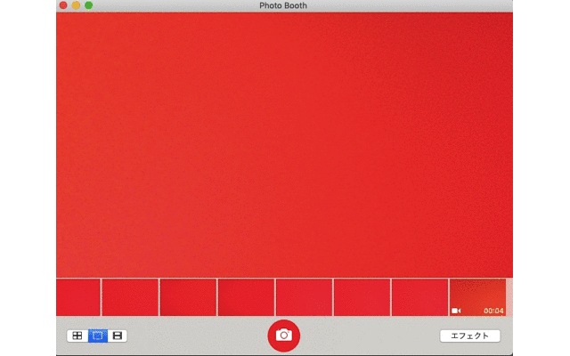

# aaa
import cv2
import os
import numpy as np
import matplotlib.pyplot as plt
from skimage.io import imread, imsave
video = cv2.VideoCapture('a.mov')
dir_name = "frame_collects"
if not os.path.exists(dir_name):
    os.mkdir(dir_name)
frame_count = int(video.get(7))
for i in range(frame_count):
    _, frame = video.read()
    cv2.imwrite(dir_name + "/" +  str(i) + ".png", frame)

im0 = imread('frame_collects/0.png')
im1 = imread('frame_collects/1.png')
im2 = imread('frame_collects/2.png')
im3 = imread('frame_collects/3.png')
im4 = imread('frame_collects/4.png')
im5 = imread('frame_collects/5.png')
im6 = imread('frame_collects/6.png')
im7 = imread('frame_collects/7.png')
im8 = imread('frame_collects/8.png')
im9 = imread('frame_collects/9.png')
im10 = imread('frame_collects/10.png')
im11 = imread('frame_collects/11.png')
im12 = imread('frame_collects/12.png')
im13 = imread('frame_collects/13.png')
im14 = imread('frame_collects/14.png')
im15 = imread('frame_collects/15.png')
im16 = imread('frame_collects/16.png')
im17 = imread('frame_collects/17.png')
im18 = imread('frame_collects/18.png')
im19 = imread('frame_collects/19.png')
im20 = imread('frame_collects/20.png')
im21 = imread('frame_collects/21.png')
im22 = imread('frame_collects/22.png')
im23 = imread('frame_collects/23.png')
im24 = imread('frame_collects/24.png')
im25 = imread('frame_collects/25.png')
im26 = imread('frame_collects/26.png')
im27 = imread('frame_collects/27.png')
im28 = imread('frame_collects/28.png')
im29 = imread('frame_collects/29.png')
im30 = imread('frame_collects/30.png')
im31 = imread('frame_collects/31.png')
im32 = imread('frame_collects/32.png')
im33 = imread('frame_collects/33.png')
im34 = imread('frame_collects/34.png')
im35 = imread('frame_collects/35.png')
im36 = imread('frame_collects/36.png')
im37 = imread('frame_collects/37.png')
im38 = imread('frame_collects/38.png')
im39 = imread('frame_collects/39.png')
im40 = imread('frame_collects/40.png')
im41 = imread('frame_collects/41.png')
im42 = imread('frame_collects/42.png')
im43 = imread('frame_collects/43.png')
im44 = imread('frame_collects/44.png')
im45 = imread('frame_collects/45.png')
im46 = imread('frame_collects/46.png')
im47 = imread('frame_collects/47.png')
im48 = imread('frame_collects/48.png')
im49 = imread('frame_collects/49.png')

x = np.arange(0, 50)
y = [im0.mean(),  im1.mean(),  im2.mean(),  im3.mean(),  im4.mean(),  im5.mean(),  im6.mean(),  im7.mean(),  im8.mean(),  im9.mean(),  im10.mean(),  im11.mean(),  im12.mean(),  im13.mean(),  im14.mean(),  im15.mean(),  im16.mean(),  im17.mean(),  im18.mean(),  im19.mean(),  im20.mean(),  im21.mean(),  im22.mean(),  im23.mean(),  im24.mean(),  im25.mean(),  im26.mean(),  im27.mean(),  im28.mean(),  im29.mean(),  im30.mean(),  im31.mean(),  im32.mean(),  im33.mean(),  im34.mean(),  im35.mean(),  im36.mean(),  im37.mean(),  im38.mean(),  im39.mean(),  im40.mean(),  im41.mean(),  im42.mean(),  im43.mean(),  im44.mean(),  im45.mean(),  im46.mean(),  im47.mean(),  im48.mean(),  im49.mean()]
    
for z in range(49):
    print("im" + str(z) + " = " + str(y[z]))

plt.plot(x, y)
plt.show

[プログラム説明]
2-5行目　環境設定を行う。
7行目　videoに3秒間撮影した動画(a.mov)を格納する。
8行目　ディレクトリの名前をframe_collectsとする。
9,10行目　ディレクトリがなければ新たなディレクトリを作る。
11-14行目　フレーム数を数え、その数だけ図を書き込む。
16-65行目　フレームを読み込み、それぞれ格納する。
67,68行目　x,yの値を設定する。
70,71行目　pngファイルの輝度値の平均値を出力する。
73,74行目　グラフをプロットする。

[実行方法]
jupyternotebookでこのページに示すコードを実装する。その際、Macではcontrol+enterで実装可能となる。
依存ライブラリはnumpy(version 1.16.2)とmatplotlib(version 3.0.3)である。

[参考にしたサイト]
https://gist.github.com/rmknp/56c1b74af89bf19d1497　(画像の輝度値の平均値を得てヒストグラムにする)
http://testpy.hatenablog.com/entry/2017/07/13/003000　(動画を画像としてフレーム分割する)

